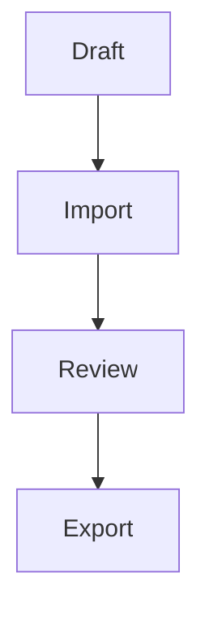

# [RULE] DingTalk Markdown Format Control Specification

- **Project**: HR Digital Cockpit
- **Document Type**: Format Control Specification
- **Status**: Active canonical
- **Role**: Stable format-control source for DingTalk-targeted outputs and project source readability rules in this project
- **Source Category**: Cross-category
- **Management-System Role**: Delivery-interface rule; outside L1-L5 hierarchy; admissible across all four task categories per [OS] §2.3.2; this source is not itself an L2, L3, L4, or L5 artifact
- **Relationship to [OS]**: Serves as the active canonical DingTalk format-control source referenced by the Project Operating Model
- **Pairings I participate in**: None currently (per [OS] §8.5.2 as of this revision)

## How to use this source

Use this source when:
- generating a DingTalk-targeted deliverable that must render as rich text in DingTalk Docs
- authoring or reviewing a project source file that may contain documented DingTalk Markdown syntax
- deciding whether a Markdown structure is safe for DingTalk import or round-trip export
- selecting the appropriate output profile (Rich Text Profile or Round-Trip Safe Profile) for the target use

Do not use this source as:
- a universal authoring requirement for every project source file
- a general Markdown tutorial
- a substitute for DingTalk's own product documentation

# 1. Role of this source file

This source file defines the Markdown control rules for:

1. DingTalk-targeted deliverables generated in this project, and
2. project source files that may contain documented DingTalk Markdown syntax.

This file is a format-control source, not a behavior prompt.

It does not require every project source file to be authored in DingTalk import-safe Markdown. Project source files may use common Markdown or documented DingTalk Markdown, as long as they remain structurally clear to Claude.

---

# 2. Two format contexts

## 2.1 Context A — Project source files for Claude reading

Objective: maximize structural readability and reliable model interpretation inside Claude Projects.

Rules:

- Prefer simple, text-forward Markdown.
- Common Markdown is the default authoring choice for project source files.
- Documented DingTalk Markdown may appear in a source file when it carries real meaning or when the file itself specifies DingTalk formatting.
- When reading source files, interpret documented DingTalk Markdown markers as formatting syntax, not as literal body text, unless they appear inside code fences, inline code, or are explicitly introduced as syntax examples.
- When a source file needs to show raw syntax literally, fence it or put it in inline code.
- Avoid decorative use of DingTalk-only markers in source files when plain Markdown can carry the same meaning with less ambiguity.
- This readability rule is a project constraint for Claude use. It is not a claim about DingTalk import behavior.

## 2.2 Context B — DingTalk-targeted deliverables

Objective: generate Markdown intended to render as rich text in DingTalk Docs.

Use one of these output profiles:

- Rich Text Profile — default for DingTalk-targeted document generation.
- Round-Trip Safe Profile — stricter profile for cases where Markdown must survive import into DingTalk Docs and export back to Markdown with minimal semantic loss.

If the task explicitly requires import/export fidelity, use the Round-Trip Safe Profile.
If the task does not require export fidelity, use the Rich Text Profile but stay inside the documented allowlist.

---

# 3. Official DingTalk compatibility baseline

Official DingTalk documentation states that DingTalk Docs supports **most** Markdown syntax and allows Markdown in import, export, paste, and editing workflows. Markdown import as an online document accepts `.md`, `.markdown`, and `.mark`, and only UTF-8 encoded files. For online-document import, the file size limit is 20 MB. Official export guidance also states that DingTalk-specific text elements may be downgraded during Markdown export.

**Source documentation** — DingTalk Docs official help center at `alidocs.dingtalk.com`, knowledge base `Y7kmbokZp3pgGLq2` (consulted 2026-05-21):

- `Markdown 使用手册` — syntax reference backing the Section 4 allowlist: https://alidocs.dingtalk.com/i/p/Y7kmbokZp3pgGLq2/docs/em7AML0b9lBV23rw0A7KJnNyqOD6vwro
- `导入 Markdown 文件` — import format / encoding / size facts: https://alidocs.dingtalk.com/i/p/Y7kmbokZp3pgGLq2/docs/KGZLxjv9VG3RmPGoslwn9adDV6EDybno
- `导出 Markdown 文件` — export downgrade behavior: https://alidocs.dingtalk.com/i/p/Y7kmbokZp3pgGLq2/docs/ZX6GRezwJl7DpGYes1OqR7ZlVdqbropQ

This means:

- Common Markdown cannot be assumed to be fully supported.
- Only explicitly documented syntax is approved in this project profile.
- Rich formatting and round-trip fidelity are related but not identical goals.

---

# 4. Officially documented syntax allowlist

Only the syntax in this section is approved for DingTalk-targeted outputs in this project.

## 4.1 Headings

Use ATX headings only:

- `#`
- `##`
- `###`
- `####`
- `#####`
- `######`

## 4.2 Text styles

Approved inline styles:

- bold: `**text**` or `__text__`
- italic: `*text*` or `_text_`
- strikethrough: `~~text~~`
- underline: `++text++`
- superscript: `^text^`
- subscript: `~text~`
- highlight: `==text==`
- inline code: `` `text` ``

Use inline code when text is functioning as a literal data field name or a similar machine-oriented identifier such as a schema field, property name, parameter name, or configuration key.

Examples:
- `sla_policy_id`
- `wf_inst_id`
- `warning_threshold_pct`

Apply this rule globally when such identifiers appear in normal text, including paragraphs, lists, tables, and similar body text.

Do not leave a literal field name as plain prose only to preserve sentence flow.
Do not convert ordinary prose into inline code unless the text is actually functioning as a field name or similar literal identifier.

## 4.3 Lists

Approved list forms:

- ordered list: `1. Item`
- alphabetical ordered list: `a. Item`
- unordered list: `* Item`
- unordered list: `- Item`
- task list: `[] Task`
- task list: `[x] Task`

## 4.4 Blockquote

- `> quoted text`

## 4.5 Links

Use documented inline link forms only:

- `[]()`
- `[label](https://example.com)`

## 4.6 Images

Use simple documented image forms only:

- ``
- ``

Do not rely on optional image title attributes or other image metadata that are not explicitly documented in the consulted DingTalk materials.

## 4.7 Tables

Pipe-table syntax is documented.

Use simple rectangular tables only.

## 4.8 Horizontal rules

Approved forms:

- `---`
- `***`

## 4.9 Code blocks

Use fenced code blocks with backticks only.

Documented forms include:

- plain fenced code block
- language-tagged fenced code block such as ```` ```js ````

## 4.10 Formulas

Approved forms:

- inline formula: `$text$`
- block formula: `$$text$$`

## 4.11 Highlight blocks

Approved forms:

- default block: `:::`
- warning block: `:::warning`
- danger block: `:::danger`
- info block: `:::info`
- success block: `:::success`
- tips block: `:::tips`

## 4.12 Emoji

Approved form:

- `:smile:`

## 4.13 Mermaid text diagrams

Use fenced Mermaid blocks only:

- ```` ```mermaid ````

---

# 5. Output profiles

## 5.1 Rich Text Profile

Use this as the default profile when the goal is to generate a rich DingTalk document.

Rules:

- Use only syntax from Section 4.
- Preserve hierarchy explicitly with headings.
- Prefer semantic structure over decorative formatting.
- Use DingTalk-specific enhancements only when they add real clarity.
- Prefer simple tables, fenced code blocks, explicit links, and linear reading order.
- Do not use undocumented Markdown extensions.
- Do not rely on editor-only DingTalk objects as part of the source Markdown contract.

## 5.2 Round-Trip Safe Profile

Use this when a Markdown file is expected to:

1. be imported into DingTalk Docs, and
2. later be exported back to Markdown with minimal semantic loss.

Additional restrictions:

- one H1 at most
- no skipped heading levels unless the source meaning clearly requires it
- no empty headings
- headings are the only section hierarchy mechanism
- no layout tricks that change reading order
- tables must be simple rectangles with one header row
- no merged-cell logic
- no multiline paragraphs inside table cells
- no lists, images, code fences, Mermaid blocks, or highlight blocks inside table cells
- literal-data-field-name inline-code rule applies inside table cells per §4.2
- use backtick fenced code blocks only
- do not place code blocks inside tables
- do not use bare URLs as structural references
- do not let essential meaning exist only inside images
- avoid alphabetic ordered lists unless the source meaning depends on alphabetic enumeration
- avoid nesting when a flatter structure can preserve meaning more safely

If a structure cannot satisfy these restrictions, choose the closest safer Markdown representation and preserve meaning first.

---

# 6. Excluded from this project profile

The following are excluded from this project profile because they are not explicitly documented in the DingTalk materials consulted for this file, or because they create avoidable ambiguity for project use:

- raw HTML blocks
- inline HTML
- HTML tables
- CSS
- JavaScript
- YAML front matter
- footnotes
- definition lists
- reference-style links
- Setext headings
- indented code blocks
- tilde-fenced code blocks
- undocumented image title or metadata patterns
- Markdown extensions not explicitly included in Section 4

The following are also excluded from DingTalk-targeted source contracts in this project because official export guidance indicates DingTalk-only elements may be downgraded:

- application tables
- multi-column layouts
- auto-numbered headings generated by the editor
- other editor-only DingTalk objects not represented as pure Markdown source

---

# 7. Validation checklists

## 7.1 Project source readability checks

Before saving a Markdown file as a project source:

- the file is structurally explicit and easy to read as plain text
- headings, lists, and tables are used to clarify structure, not obscure it
- any raw DingTalk syntax examples are fenced or code-spanned
- documented DingTalk formatting markers are not accidentally used as literal prose
- literal-data-field-name inline-code rule per §4.2 applied
- the file is English if it is a control file, prompt file, or source specification unless explicitly intended otherwise

## 7.2 DingTalk-targeted deliverable checks

Before finalizing a DingTalk-targeted deliverable:

- every syntax form used is listed in Section 4
- no excluded syntax appears
- the document remains understandable as plain text
- headings carry the section hierarchy
- the reading order is linear
- links are explicit
- code blocks are fenced
- tables are simple enough for the selected profile
- literal-data-field-name inline-code rule per §4.2 applied

## 7.3 High-risk round-trip checks

When Round-Trip Safe Profile is in scope, verify:

- no table structure depends on visual layout tricks
- no code content is embedded in a table cell
- literal-data-field-name inline-code rule per §4.2 holds after round-trip (inline-code spans preserved through export when identifiers carry semantic load)
- no paragraph break changes the intended reading order
- no visual emphasis is substituting for heading structure
- no DingTalk-only editor object carries essential meaning
- exported Markdown should preserve text, order, hierarchy, links, code text, and table meaning at minimum

---

# 8. Minimal English examples

## 8.1 Heading structure

```markdown
# Project Overview

## Scope

This document defines the migration scope.

## Notes

The delivery date is fixed.
```

## 8.2 Text styles

```markdown
Use **bold**, *italic*, and `inline code` only when they improve clarity.

When referring to a field name, write `sla_policy_id` as inline code.
```

## 8.3 Lists

```markdown
1. Prepare the source file.
2. Import the file into DingTalk Docs.
3. Export the document back to Markdown.

- Keep the hierarchy stable.
- Keep the reading order stable.

[] Draft complete
[x] Review complete
```

## 8.4 Link and image

```markdown
[Project portal](https://example.com/portal)


```

## 8.5 Table

```markdown
| Field | Value |
| --- | --- |
| Field name | `sla_policy_id` |
| Join key | `wf_inst_id` |
| Status | Approved |
```

Write field names such as `sla_policy_id`, `wf_inst_id`, and `warning_threshold_pct` as inline code in tables and in normal prose.
Do not leave them as plain prose when they are being used as literal identifiers.

## 8.6 Code block

````markdown
```python
def normalize(text: str) -> str:
    return text.strip()
```
````

## 8.7 Formula

```markdown
Inline formula: $a+b$

Block formula:
$$a+b$$
```

## 8.8 Highlight block

```markdown
:::warning
Do not replace heading structure with visual styling.
:::
```

## 8.9 Mermaid

````markdown

````

